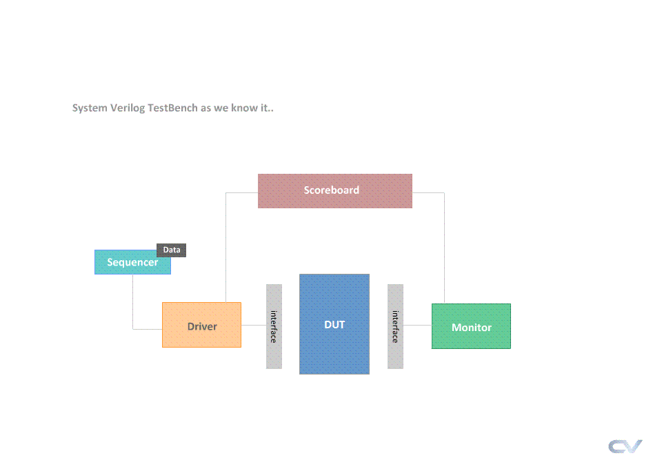

# ALU
An ALU (Arithmetic Logic Unit) is a component that can perform various operations such as addition, subtraction, multiplication, division, as well as logical operations like AND, OR, NAND, NOR, XOR, XNOR, and comparison.

---
## Inputs  
**Opereand A** : 8 bits input. 
**Opereand B** : 8 bits input. 
**ALU FUNC** : 4 bits input. 
**EN** : 1 bit input. 
**CLK** : 1 bit input. 
**RST** : 1 bit input. 

---
## Outputs  
**ALU OUT** : 16 bits output. 

---
## Verification Environment
During verification, I focused on implementing a class-based environment consisting of several elements such as the sequencer, driver, interface, DUT, monitor, and scoreboard. These components offer features like scalability, maintainability, and reusability, primarily relying on object-oriented programming (OOP) principles.

Our test cases primarily focused on testing system features with various operands using constrained randomization, as outlined in the following table. Assertions and coverage were not included, as our primary objective was to establish a class-based environment. Additional features can be extended later.

| Test       | Feature             | Output             |
|------------|:-------------------:|:------------------:|
| Test Cae 1 |  Reset = 0          | AlUOUT = 0         |
| Test Cae 2 |  Reset = 0 , EN = 1 | AlUOUT = 0         |
| Test Cae 3 |  Reset = 1 , EN = 0 | AlUOUT = 0         |
| Test Cae 4 |  EN = 1 , ADD       | AlUOUT = A + B     |
| Test Cae 5 |  EN = 1 , SUB       | AlUOUT = A - C     |
| Test Cae 6 |  EN = 1 , MUL       | AlUOUT = A * B     |
| Test Cae 7 |  EN = 1 , DIV       | AlUOUT = A / B     |
| Test Cae 8 |  EN = 1 , AND       | AlUOUT = A & B     |
| Test Cae 9 |  EN = 1 , OR        | AlUOUT = A | B     |
| Test Cae 10|  EN = 1 , NAND      | AlUOUT = !(A & B)  |
| Test Cae 11|  EN = 1 , NOR       | AlUOUT = !(A | B)  |
| Test Cae 12|  EN = 1 , XOR       | AlUOUT = A ^ B     |
| Test Cae 13|  EN = 1 , XNOR      | AlUOUT = !(A ^ B)  |
| Test Cae 14|  EN = 1 , CompEqual | AlUOUT = A == B    |
| Test Cae 15|  EN = 1 , CompLarge | AlUOUT = A > B     |
| Test Cae 16|  EN = 1 , CompSmall | AlUOUT = A < B     |
| Test Cae 17|  EN = 1 , ShiftRight| AlUOUT = A >> 1    |
| Test Cae 16|  EN = 1 , ShiftLeft | AlUOUT = A << 1    |

---

